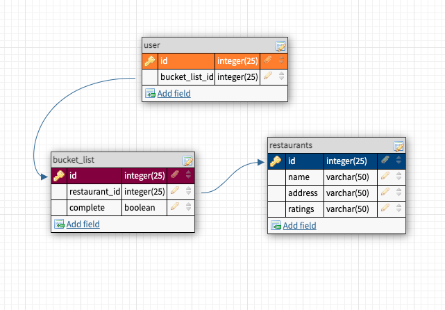

# restaurant-recommendations

Makan bah! is a restaurant recommendations website, which allows it's users to search for restaurants nearby them and also create a personalised bucket-list of their restaurant choices. The name "Makan bah!" was derived from the word "Makan", which means "Eat" in the English language, and "bah" from Sabahan slang which is a colloquial words used in Sabah, Malaysia. With Makan Bah!, you don't have to worry again where to eat next!

## Project Description
Makan bah! project is to allow its users to search for nearby restaurants and are able to add restaurants into their bucket list for future visits.

**FOR**: Foodies that have difficulties of figuring out where to have their next meals in Kota Kinabalu

**WHO**: Like to explore new food and restaurants.

**THE**: Product    IS: A platform

**THAT**: Delivers restaurant recommendations and has a personalised bucket-list

**UNLIKE**: Wasting time figuring out where to eat

**OUR PRODUCT**: Saves users’ time and enhances users’ restaurant search experience


## MVP
### Current Feature
- List of restaurants displayed in the front-end with a button called bucket-list
- Selected/clicked restaurant will be added into the bucket list with a set of completed and delete button. When users have visited the restaurant, they can click on the completed button and/or delete button

### Future Feature
- 'Go Now' Button that allows live direction to the restaurant's location
- Points collector. With every bucket-list completed, points will be collected
- Self add restaurant listing features. Restaurants are able to add themselves into the restaurant listing


## Database Schema and API
- 


## Setup
### Dependencies 

- Run `npm install` in project directory. This will install server-related dependencies such as `express`.
- `cd client` and run `npm install` and `yarn install`. This will install client dependencies (React).

### Database Prep

- Access the MySQL interface in your terminal by running `mysql -u root -p`
- Create a new database called makanbahDB: `create database makanbahDB`
- Add a `.env` file to the main folder of this repository containing the MySQL authentication information for MySQL user. For example:

```bash
  DB_HOST=localhost
  DB_USER=root
  DB_NAME=makanbahDB
  DB_PASS=YOURPASSWORD
```

- Run `npm run migrate` in the main folder of this repository, in a new terminal window. This will create three tables called 'restaurants', 'bucket_list', and 'user' in your makanbahDB database.

### Development

- Run `npm start` in project directory to start the Express server on port 5000 
- Go to `(localhost:5000/users)` to view the restaurants' list
- `cd client` and run `npm start` to start client server in development mode with hot reloading in port 3000 `(localhost:3000)`

## Basic Requirements

### Create your API Key
* [ ] Get your API Key from [here](https://developers.google.com/places/web-service/get-api-key)
Follow all the steps in the link:

1. Creating API keys, 
2. Adding the API key to your request, 
3. Restricting API keys

### Display a list of restaurants in your front-end
* [ ] Get the restaurants in Kota Kinabalu database from Google Place API. You can access the API from https://maps.googleapis.com/maps/api/place/nearbysearch/jsonlocation=5.9804,116.0735&radius=1500&type=restaurant&key=YOUR_API_KEY
Remember to key in `YOUR_API_KEY` to the end of the link provided.
* [ ] Save the data into a JSON file (to avoid "No Access Allow Origin" error)
* [ ] Store the JSON file inside your public folder 

### Create a button that will insert the selected restaurant into the bucket-list page.
* [ ] Add functionality.
When you get the list of restaurants displayed on the front-end, add a 'bucket list' button to each restaurants. When you click on the button, the selected restaurant should be added into the bucket-list.
* [ ] Add styling.
Make it look as polish as possible. Use bootstrap if preferred. 


## Notes
_This is a student project that was created at [CodeOp](http://CodeOp.tech), a full stack development bootcamp in Kuala Lumpur._
